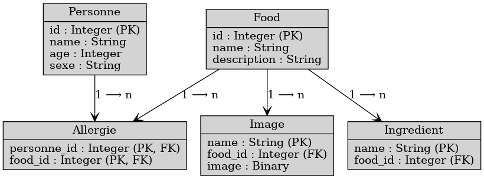
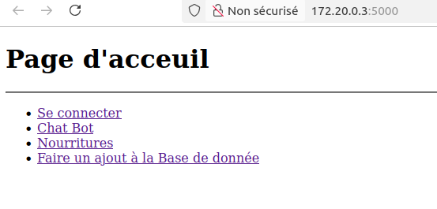
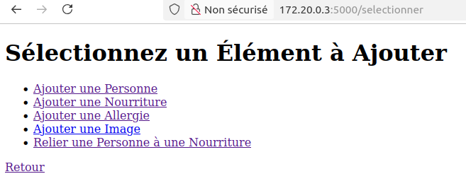
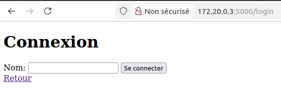
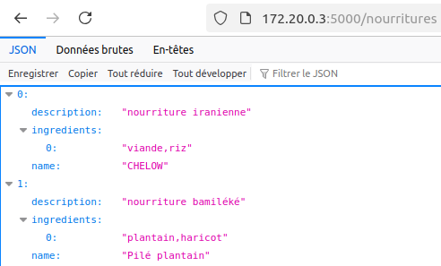
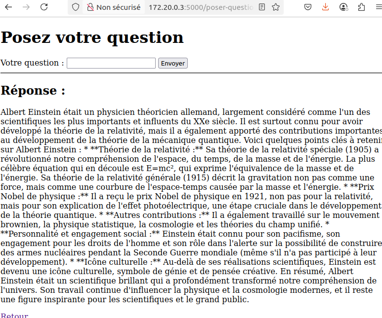

# Université de Yaoundé I / University of Yaounde I  
### Faculté des sciences / Faculty of Sciences  
#### Département d’informatique / Computer Science Department  

---

# RAPPORT TP INF222

**TCHANA YOTAT WILFRIED TREVOR**  
**Matricule : 23U2551**  
**Examinateur : Dr Jiomekong**

---

## 1. Introduction

Dans le cadre du TP de l’unité d’enseignement INF222, il nous a été demandé de concevoir une application de gestion de l’alimentation des utilisateurs.  
Ce rapport a pour but de présenter l’application conçue.

L’application est une API construite avec **Flask**, permettant de gérer des interactions avec une base de données **PostgreSQL** via le module `psycopg2`.  
Elle permet d’ajouter des données sur des personnes, des nourritures et des ingrédients, tout en offrant des opérations de base sur la base de données.

---

## 2. Architecture de l'Application

### 2.1 Technologies Utilisées
- **Langage de Programmation** : Python  
- **Framework** : Flask  
- **Base de Données** : PostgreSQL  
- **Connecteur** : psycopg2  
- **Containerisation** : Docker  
- **API** : Gemini (Google GenAI)

### 2.2 Fonctionnalités
- Ajouter une personne  
- Ajouter une nourriture  
- Ajouter des ingrédients  
- Relier une personne à ce qu'elle a mangé  
- Discuter avec un chatbot  

---

## 3. Diagramme de Classe

                                                                                                   

### 3.1 Relations
- **Personne** a une relation avec **Manger** (une personne peut manger plusieurs nourritures)  
- **Food** a une relation avec **Ingredient** (une nourriture peut avoir plusieurs ingrédients)  
- **Manger** relie **Personne** et **Food**

### 3.2 Conception du chatbot

Notre chatbot est accessible via la route `/poser-question`, réalisé grâce à l’API **Gemini**.

Extrait de la fonction `obtenir_reponse_gemini` :

```python
def obtenir_reponse_gemini(question):
    try:
        chat = client.chats.create(model='gemini-2.0-flash')
        response = chat.send_message(question)

        if response.candidates and len(response.candidates) > 0:
            first_candidate = response.candidates[0]
            content = first_candidate.content
            text_response = content.parts[0].text
            return text_response
        else:
            return "Aucune réponse trouvée."
    except Exception as e:
        print(f"Erreur lors de l'obtention de la réponse : {e}")
        return "Erreur lors de la génération de la réponse"
```

## 4. Déploiement avec Docker / Docker Deployment

### 4.1 Structure du Dockerfile / Dockerfile Structure

Le fichier `Dockerfile` est conçu pour installer les dépendances requises et exécuter l'application.

```Dockerfile
# Utiliser une image de base Python / Use a base Python image
FROM python:3.10-slim

# Installer les dépendances système / Install system dependencies
RUN apt-get update && apt-get install -y \
    gcc \
    libpq-dev \
    python3-dev \
    && rm -rf /var/lib/apt/lists/*

# Définir le répertoire de travail / Set the working directory
WORKDIR /FOODAPP

# Copier les fichiers nécessaires / Copy the project files
COPY requirements.txt requirements.txt
RUN pip install --upgrade pip && pip install --no-cache-dir -r requirements.txt
COPY . .

# Exposer le port / Expose application port
EXPOSE 5000

# Commande pour exécuter Flask / Run Flask app
CMD ["flask", "run", "--host=0.0.0.0"]
```

## 5. Exécution de l’application

### Étapes pour exécuter l’image Docker de l’application

#### 🐳 1. Télécharger l’image Docker

Utilisez la commande suivante pour télécharger l’image depuis Docker Hub :

```bash
docker pull trevor2504/mon_application_food:tag
```
## 6. Tester l'application
Pour tester l'application, il faut tout d'abord la lancer avec la commande :
```bash
 docker-compose up --build
```
Ensuite ouvrir le lien affiché dans le terminal avec votre navigateur.
Vous tomberez sur la page d'acceuil de l'application ci dessous :



Vous avez devant vous le menu de l'application.
cliquez tout d'abord sur faire un ajout à la base de données, vous verrez la page suivante :



Vous pouvez maintenant :
- **Ajouter une personne**
- **Ajouter une nourriture**
- **Ajouter une allergie**
- **Lier une personne à une nourriture**

Retournez ensuite à la page d'acceuil et cliquer sur se connecter, la page suivante s'affichera :



Entrez maintenant le nom d'un utilisateur préalablement ajouté à la base de données et valider. vous tomberez sur une page avec des informations sur l'utilisateur connecté


Retournez à la page d'acceuil et cliquez sur Nourritures pour voir la liste des nourritures de la Base de données



Retournez une fois de plus à la page d'acceuil cette fois pour tester le Chatbot (clone de gemini). Cliquez sur Chat Bot et vous verrez la page suivante (exemple de répose pour le recherche: qui est Albert Einstein): 




## Algorithme Allergie

Voici un algorithme simple pour déterminer la probabilité qu'une nourriture provoque une allergie chez une personne, en fonction du nombre de fois qu'elle a mangé cette nourriture et du nombre de fois où cela a entraîné une allergie.

### Algorithme

1. **Entrées :**
   - `n` : nombre total de fois que la personne a mangé la nourriture.
   - `a` : nombre de fois que la nourriture a provoqué une allergie.

2. **Calcul de la probabilité :**
   - Si `n` est égal à 0, alors la probabilité est indéfinie (ou 0% par défaut).
   - Sinon, la probabilité `P` que cette nourriture provoque une allergie est calculée comme suit :

   \[
   P = \frac{a}{n}
   \]

3. **Sortie :**
   - Retourner la probabilité `P`.

---

### Pseudocode

```plaintext
fonction calculerProbabilite(n, a):
    si n == 0 alors:
        retourner "Indéfini"  // ou retourner 0
    fin si
    
    P = a / n
    retourner P
fin fonction
```


## 7. Conclusion

Cette application permet une **gestion simple et efficace** des données liées aux personnes, aux nourritures et aux ingrédients à travers une API construite avec **Flask**.

L'utilisation de **Docker** facilite grandement le déploiement, la portabilité et la reproductibilité de l’environnement d’exécution.

Grâce à l’intégration de l’**API Gemini** de Google, un **chatbot intelligent** est mis à disposition des utilisateurs, capable de répondre à des questions nutritionnelles ou générales.

Les éléments fournis dans ce projet — comme le diagramme de classes, l’architecture logicielle, l’algorithme de détection d’allergies et le schéma d’exécution via Docker — renforcent la compréhension du fonctionnement global du système.

Ce projet constitue une base solide pour développer des solutions plus complexes autour de la **santé alimentaire assistée par intelligence artificielle**.

---

🔗 **Lien du dépôt GitHub (code source complet)** :  
[https://github.com/TREVOR-TWYT/mon_application_food.git](https://github.com/TREVOR-TWYT/mon_application_food.git)

